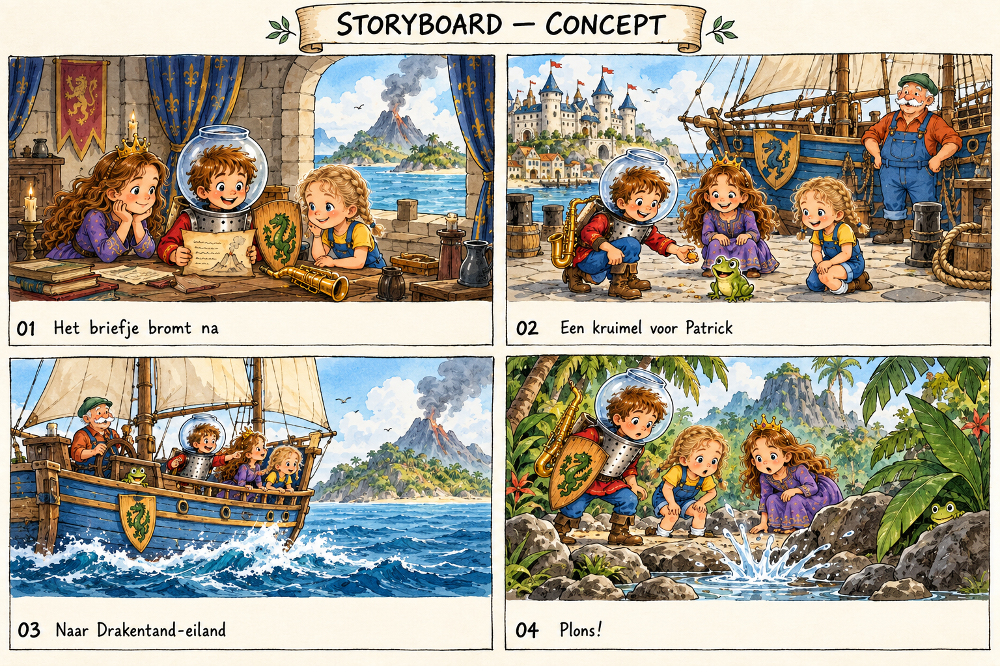
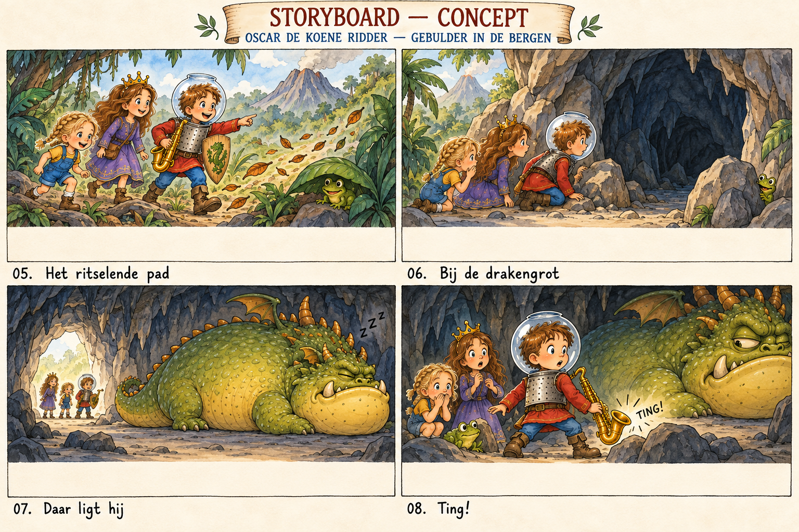
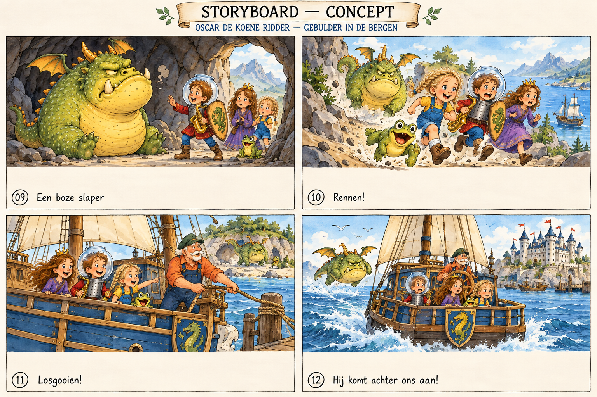
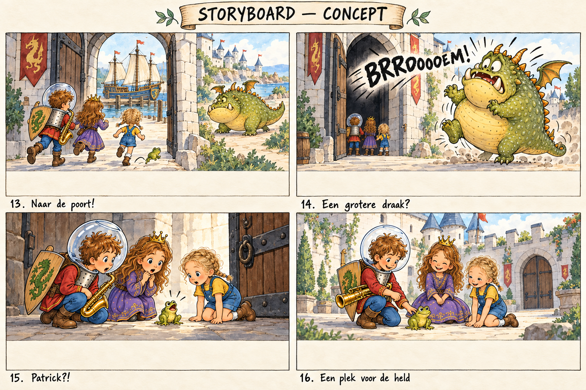

# Visueel storyboard — concept v001

Vier overzichtsbladen bij [geschreven storyboard v002](storyboard-v002.md). Gemaakt met ingebouwde image_gen, 30 september 2026. Dit zijn compositieconcepten, geen goedgekeurde illustraties of drukbestanden. De afzonderlijke spreadspecs blijven leidend.

## Spreads 01-04

[Exacte prompt 1](../../prompts/illustration/storyboard-board-1-v001.md)

## Spreads 05-08

[Exacte prompt 2](../../prompts/illustration/storyboard-board-2-v001.md)

## Spreads 09-12

[Exacte prompt 3](../../prompts/illustration/storyboard-board-3-v001.md)

## Spreads 13-16

[Exacte prompt 4](../../prompts/illustration/storyboard-board-4-v001.md)

## Reviewpunten vóór uitwerking

Alle 16 verhaalbeats zijn zichtbaar; Elke volgt de blonde vlechtcorrectie en de draak heeft de vooruitstekende onderkaak. De overtocht en kasteelclimax zijn opgenomen zonder een echte tweede draak.

- De tekstzones zijn nog te smal voor de voorgeschreven onderste circa 1/3; per uiteindelijke spread opnieuw uitzetten. Thumbnails zijn geen 3000-px productiespreads.
- Oscars vissenkomhelm krijgt herhaaldelijk een onjuiste bovenopening; vóór definitief artwork corrigeren naar opening uitsluitend op schouders. In 01 draagt hij bovendien uitrusting waar de spec basisoutfit bedoelt.
- Exact schildembleem, scheepsaanzichten, masten en relatieve groottes per spread controleren; Patrick oogt in 10 te groot en Elke soms te groot naast Oscar.
- In 08 moet het contact tussen saxofoon en steen duidelijker; 11 toont losgooien niet ondubbelzinnig.
- In 13 lijkt de looprichting door de poort naar de haven gericht; camera/geografie corrigeren vóór uitwerking zodat de kinderen vanuit haven naar binnen vluchten.
- Referenties zijn niet door deze generatie vervangen. Conceptvoorstellen blijven ter auteursreview.

