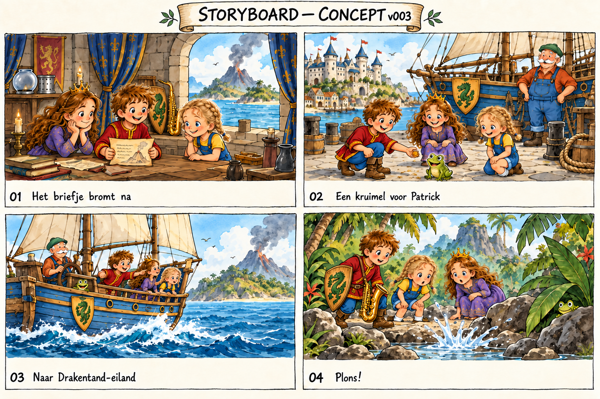
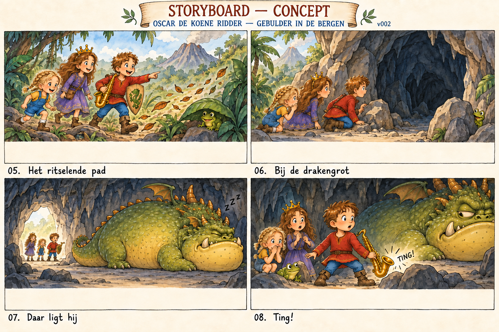
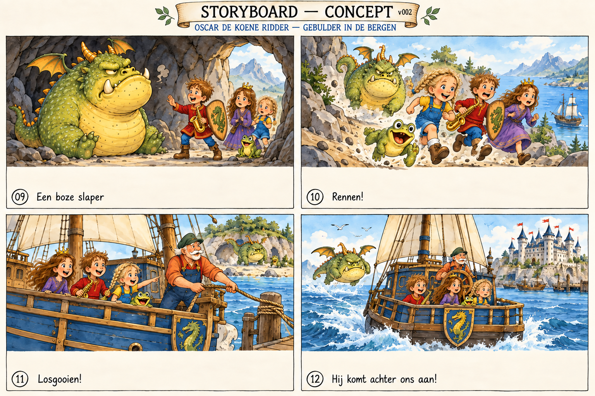
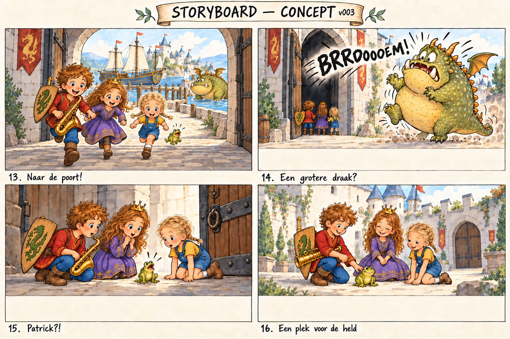

# Visueel storyboard — concept v002

Vier overzichtsbladen bij [geschreven storyboard v002](storyboard-v002.md). Gemaakt met ingebouwde image_gen, 30 september 2026. Dit zijn compositieconcepten, geen goedgekeurde illustraties of drukbestanden. De afzonderlijke spreadspecs blijven leidend.

## Spreads 01-04

[Exacte prompt 1](../../prompts/illustration/storyboard-board-1-v001.md)

## Spreads 05-08

[Exacte prompt 2](../../prompts/illustration/storyboard-board-2-v001.md)

## Spreads 09-12

[Exacte prompt 3](../../prompts/illustration/storyboard-board-3-v001.md)

## Spreads 13-16

[Exacte prompt 4](../../prompts/illustration/storyboard-board-4-v001.md)

## Reviewpunten vóór uitwerking

Alle 16 verhaalbeats zijn zichtbaar; Elke volgt de blonde vlechtcorrectie en de draak heeft de vooruitstekende onderkaak. De overtocht en kasteelclimax zijn opgenomen zonder een echte tweede draak.

- De tekstzones zijn nog te smal voor de voorgeschreven onderste circa 1/3; per uiteindelijke spread opnieuw uitzetten. Thumbnails zijn geen 3000-px productiespreads.
- Exact schildembleem, scheepsaanzichten, masten en relatieve groottes per spread controleren; Patrick oogt in 10 te groot en Elke soms te groot naast Oscar.
- In 08 moet het contact tussen saxofoon en steen duidelijker; 11 toont losgooien niet ondubbelzinnig.
- Referenties zijn niet door deze generatie vervangen. Conceptvoorstellen blijven ter auteursreview.

## Revisie v002

Oscar draagt in alle scènes zijn basisoutfit zonder helm of harnas. In scène 01 staat de oude uitrusting subtiel op een plank. Overige reviewpunten blijven gelden.

[Revisieprompt en bronnen](../../prompts/illustration/storyboard-no-armor-v002.md). De hierboven gelinkte oorspronkelijke prompts documenteren de basisbeelden.

## Scène 13 — revisie v003

Vluchtrichting gecorrigeerd: kinderen naar de camera, door de poort het kasteel in; Zeebries aan de kade en draak achter hen in de haven. [Exacte revisieprompt](../../prompts/illustration/storyboard-scene-13-v003.md). Concept: uitdrukkingen nog aanscherpen naar buiten adem; kinderen ogen nu vrolijk.

## Objectcorrecties scènes 01–04 — v003

Saxofoon en schild in 01 naar achtergrond; scheepsdraak in 02 groen; saxofoon in 04 met schouderband. [Prompt en controle](../../prompts/illustration/storyboard-props-01-04-v003.md). Bij uitwerking saxofoon in 02 terugbrengen: deze is onbedoeld verdwenen in de bewerking.
